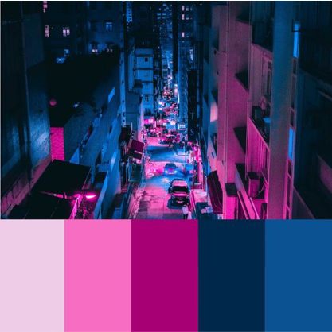
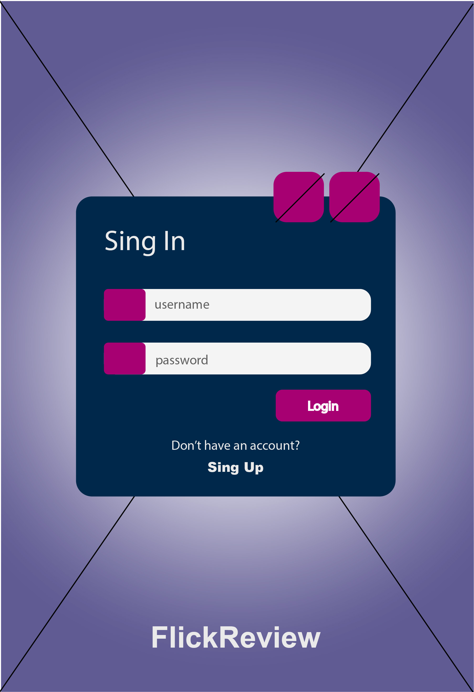
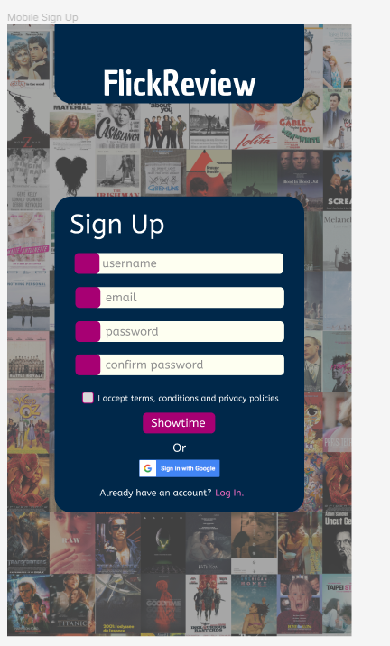
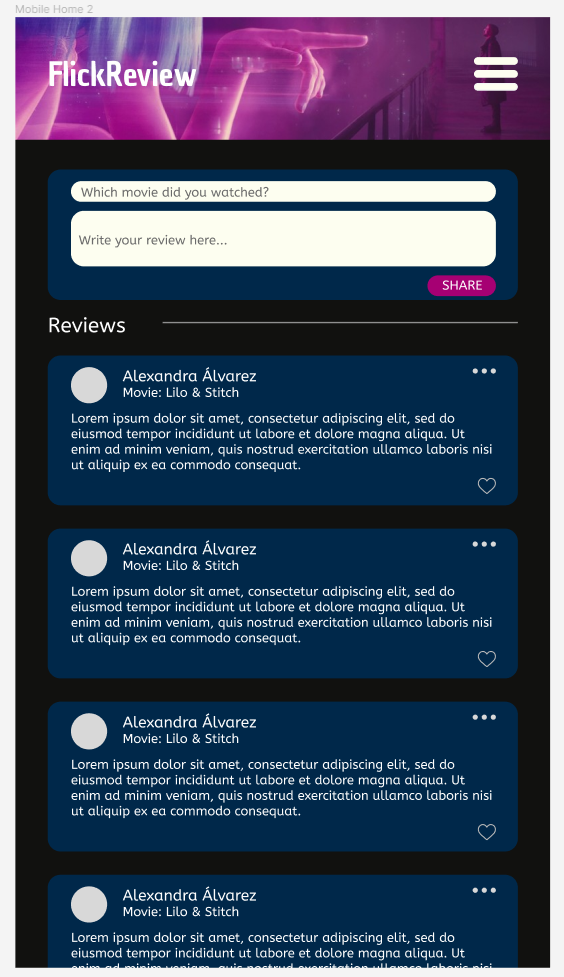
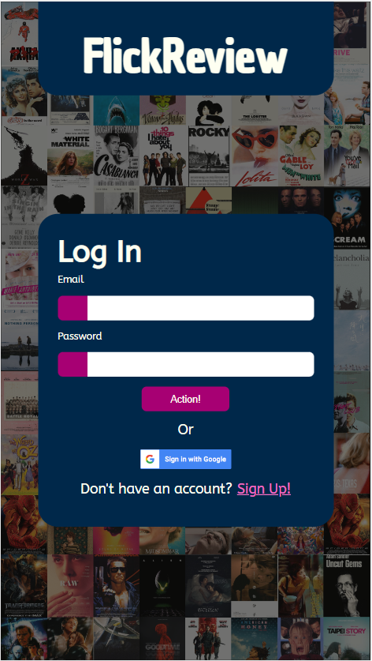
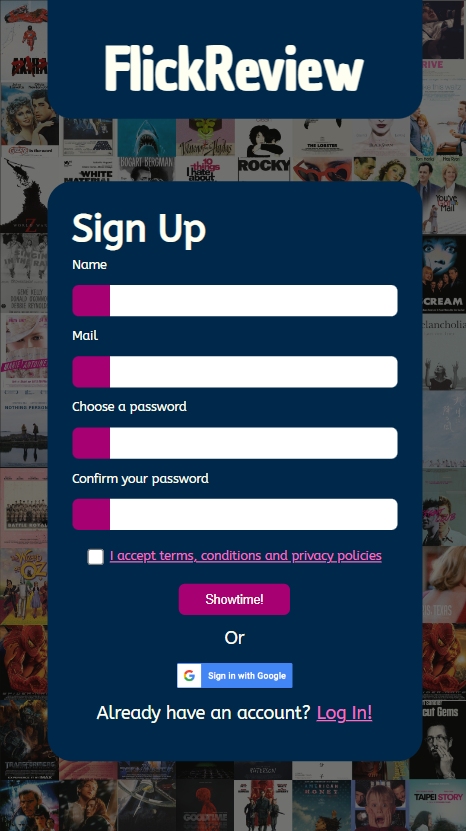
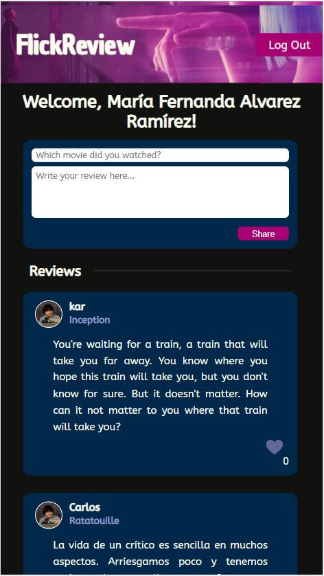
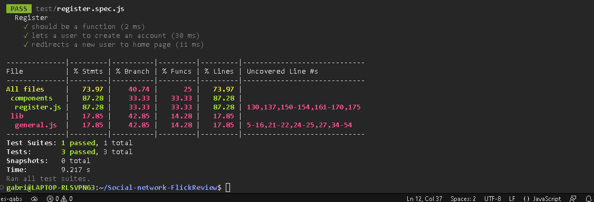

# FlickReview -  A social network for those who love movies

## Index

* [1. Introduction](#1-introduction)
* [2. Inspiration](#2-inspiration)
* [3. Prototypes](#3-prototypes)
* [4. Final Version](#4-final-version)
* [5. Usability Tests](#5-usability-tests)
* [6. Unitary Tests](#6-unitary-tests)
* [7. Credits and Acknowledgments](#7-credits-and-acknowledgments)

## 1. Introduction

FlickReview is a social network for movie lovers who enjoy sharing with other people
their opinions about the movies they watch, no matter what genre they are, freely mentioning what they enjoyed
and what not so much.

This application arose to be able to share reviews, criticisms and comments about movies through
short posts and interact with others through them.

## 2. Inspiration

We adapted elements that we enjoy from other social networks such as the implementation of Facebook's 'like',
write about movies on the same site with different registered users such as Letterboxd and iCheckMovies,
and finally a view of the posts made by users similar to Twitter.

The color palette that we use in our application, vibrant shades like pink and blue that go well with whites 
and purples, takes as a reference the feeling that beingin a movie theater brings to life.

## 3. Prototypes

We did low fidelity prototyping in photoshop and high fidelity prototyping in figma for the login sections,
registration (register) and main page (home).

Next, we present one of the low-fidelity prototypes of the login view and then two high-fidelity 
prototypes of the register and home section respectively as examples.

## 4. Final Version

In the final version of the application that has authentication, the login and register layouts are available to all those who access the site,
but to be able to make and view the publications of other registered users it's necessary to create an account or log in.

Deployed via Firebase Hosting and available [here](https://flickreview-labo.web.app/).

## 5. Usability Tests

During various phases of development, usability tests were carried out with different groups of users.

The purpose of the first test was to find out if the navigation flow to register and login was
intuitive for someone who was not familiar with the platform.

The feedback received 
during these interviews was used to improve the user experience.

Tests were then performed to create posts once the user logged in.

[Here](https://drive.google.com/drive/folders/1ITEjvpeOtdn4RiyqYyzLB0EfyTRORURy?usp=sharing) you can check the records.

## 6. Unitary Tests

In this project we introduce ourselves to testing through the creation of data mocks and function mocks.

It was necessary to create mocks of all those functions that belonged to Firebase, as well as to make use of JSdom to simulate the environment of a browser.

Being an introduction, we created only three unit tests of the registration section of our application.

## 7. Credits and Acknowledgments

This project was carried out by Alexandra Álvarez, Fernanda Álvarez and Gabriela Horcasitas.

Thanks to the coaches and teams that supported us, shared their knowledge and accompanied us during this process.
Special thanks to Julissa Rodriguez, who guided and inspired us during our frustrating moments.

We also thank Michiberto, Mila, Lina, Aysa, Midi and Suavi for keeping an eye on us while we worked so we didn't lose concentration.
